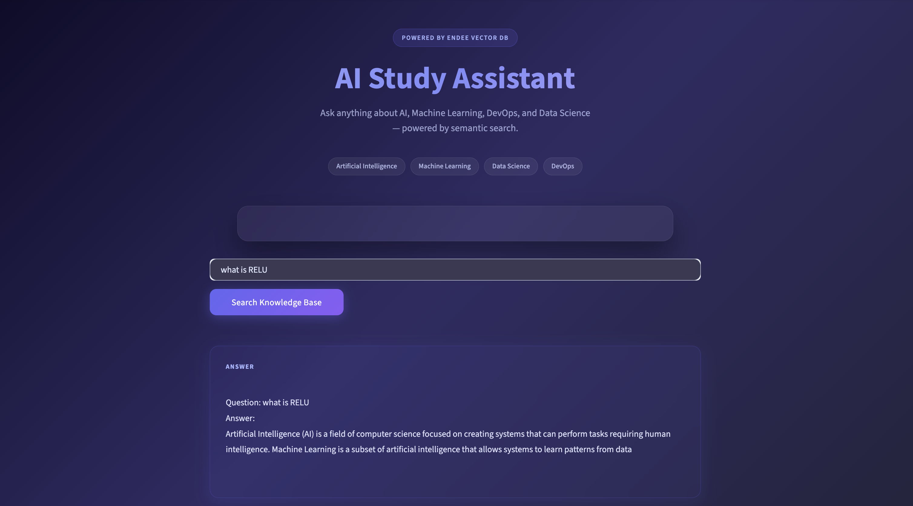
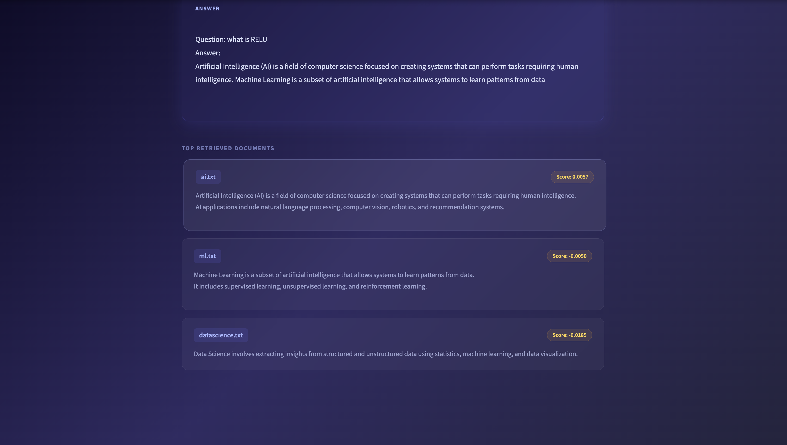
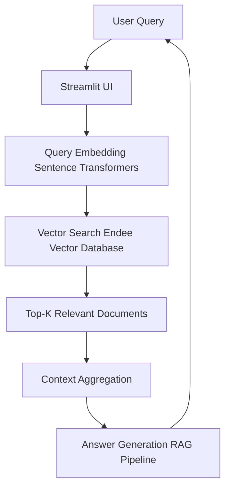

# AI Study Assistant using Endee Vector Database

## Project Overview

This project implements an AI-powered study assistant that allows users to ask questions about topics such as Artificial Intelligence, Machine Learning, DevOps, and Data Science.

The system uses semantic search and a Retrieval Augmented Generation (RAG) pipeline to retrieve the most relevant documents from a vector database and generate an answer based on the retrieved context.

The project demonstrates how a vector database can be used to build intelligent AI applications.

Vector storage and similarity search are powered by **Endee Vector Database**.

---

## Screenshots

**Home Page**



**Search Results**



---


## Problem Statement

Traditional keyword-based search often fails to understand the meaning of a query. This project solves that problem using semantic search, which retrieves documents based on meaning rather than exact keywords.

By combining semantic retrieval with a RAG pipeline, the system can provide more relevant answers.

---

## System Architecture



---

## Project Structure

```text
ai-study-assistant-endee/

 app.py             # Streamlit UI
 ingest.py          # Document ingestion and embedding generation
 rag.py             # Retrieval Augmented Generation pipeline
 search.py          # Vector search logic
 search_test.py     # Command-line testing script
 requirements.txt   # Project dependencies
 README.md

 data/              # Knowledge base documents
    ai.txt
    ml.txt
    devops.txt
    datascience.txt

 embeddings/        # Reserved for embeddings storage
```

---

## How Endee Vector Database Is Used

Endee is used as the core vector database for storing document embeddings and performing similarity search.

Workflow:

1. Text documents are converted into embeddings using Sentence Transformers.
2. Embeddings are inserted into the Endee vector database.
3. User queries are converted into embeddings.
4. Endee performs similarity search to retrieve the most relevant documents.

This allows efficient semantic search across the knowledge base.

---

## Setup Instructions

### 1 Start Endee Vector Database

```bash
docker run -p 8080:8080 endeeio/endee-server
```

---

### 2 Install Dependencies

```bash
pip install -r requirements.txt
```

---

### 3 Ingest Documents

```bash
python ingest.py
```

This step converts documents into embeddings and stores them in Endee.

---

### 4 Run the Application

```bash
streamlit run app.py
```

Open the browser:

```text
http://localhost:8501
```

---

## Example Queries

Try asking questions such as:

- What is artificial intelligence?
- Explain machine learning.
- What is DevOps?
- What is data science?

The system will retrieve the most relevant documents and generate a response.

---

## Key Features

- Semantic Search
- Retrieval Augmented Generation (RAG)
- Vector Database Integration
- Top-K Document Retrieval
- Interactive Streamlit Interface

---

## Technologies Used

- Python
- Streamlit
- Sentence Transformers
- Endee Vector Database
- Docker

---

## Future Improvements

- Add LLM integration for better answer generation
- Support PDF document ingestion
- Deploy application online
- Add conversational memory

---

## Author

Ayush Kumar
